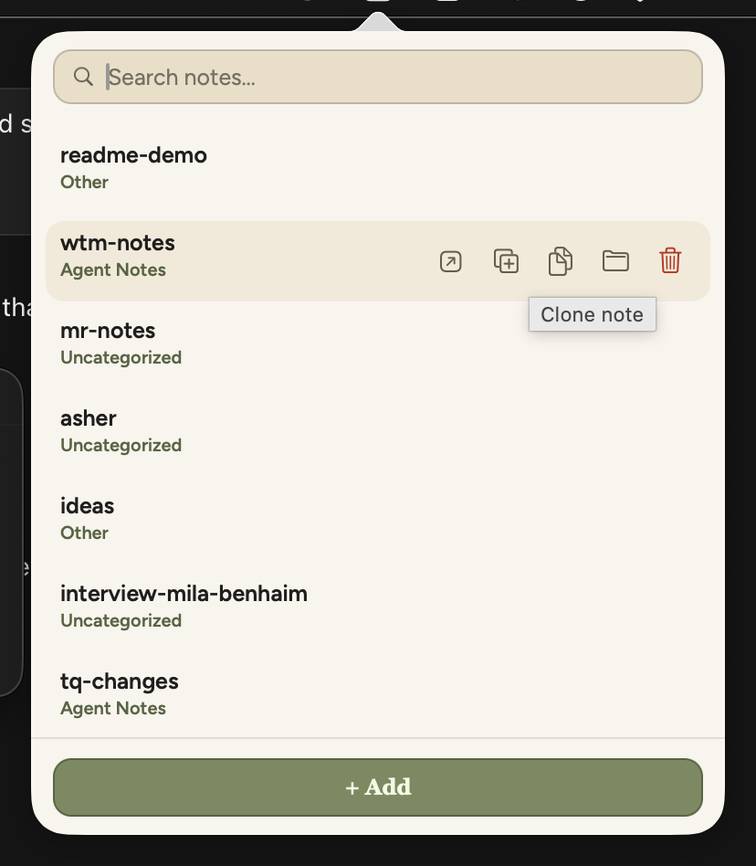
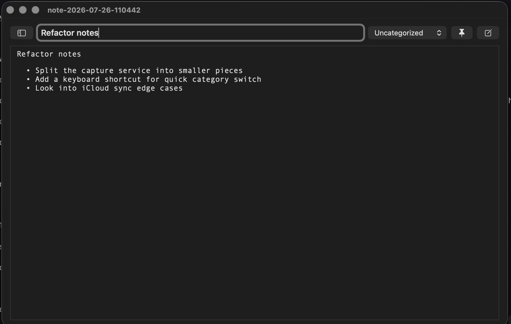
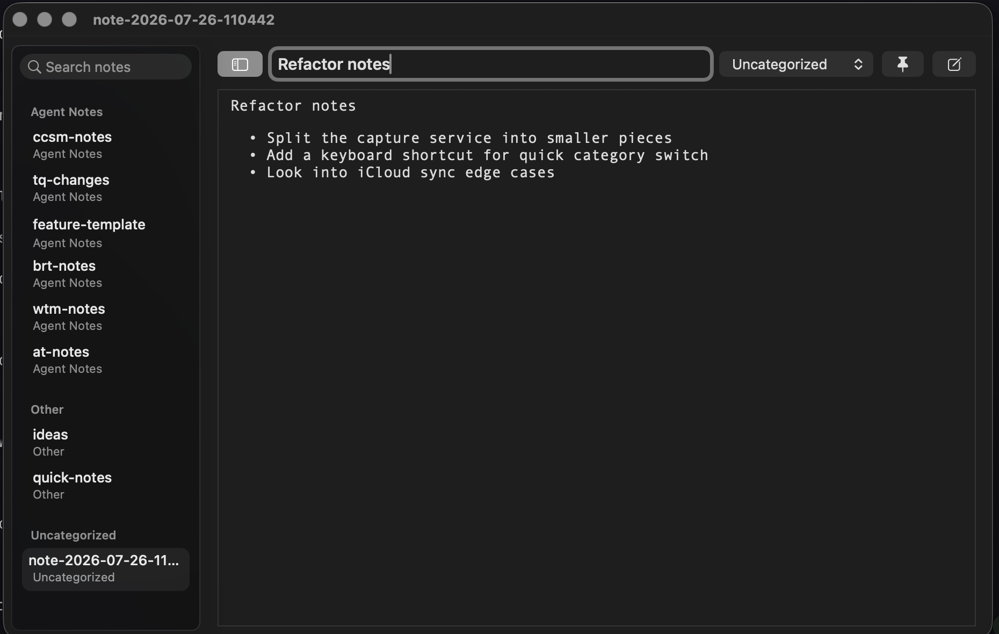
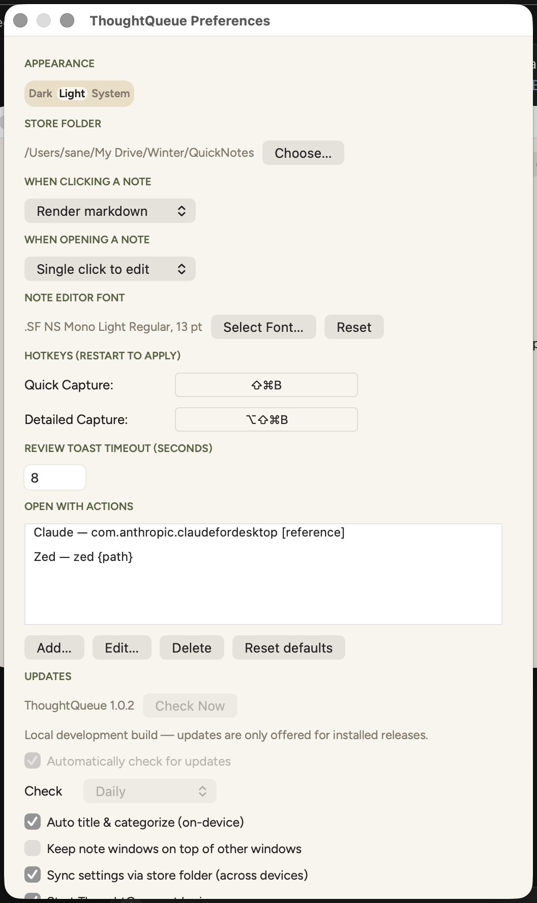

# ThoughtQueue

A macOS menu bar app for capturing quick notes from anywhere and doing something useful with them right away -- copy them, or run them straight into whatever app or command you use next. Notes are plain markdown files on disk, not locked in a database or tied to any one destination.

## Why

You're reading something, debugging code, or thinking out loud and want to jot it down without breaking flow. ThoughtQueue lives in your menu bar: grab text with a hotkey (or just type a note), file it into a category, and when you're ready, copy it or fire it off to an editor, a CLI tool, or an app like Claude Desktop with one click.

## Features

- **Global hotkeys** -- capture selected text from any app without switching windows
- **Quick capture** -- one shortcut saves instantly, no interruption
- **Detailed capture** -- a second shortcut opens the note editor pre-filled with the selection so you can adjust it before saving
- **Add note** -- write a note from scratch via the `+ Add Note` button in the popover or main window
- **Note editor** -- a single window per note with a view/edit toggle: markdown renders by default, click or start typing to edit the raw text, with autosave and full undo/redo (Cmd+Z / Cmd+Shift+Z)
- **Navigation panel** -- the note window has a collapsible panel on the left listing every note grouped by category, with a search field. Hidden by default; the sidebar button in the header (or Ctrl+Cmd+S) reveals it, and picking a note switches the window over to it
- **Copy, don't just open** -- one click to copy a note's full body or its file path straight to the clipboard, right from its row
- **Clone note** -- duplicate a note from the popover row; the copy keeps the same body and category, titled `copy <original>`
- **Run notes anywhere** -- configurable "Open With" destinations: run a shell command against the note's file (open it in an editor, hand it to a CLI tool, whatever `{path}` template you want), or paste it into an app like Claude Desktop. Comes with Claude and Zed presets; add, edit, or remove your own in Preferences
- **Categories** -- organize notes however you want; create, rename, move between, or delete categories, with folders on disk to match. New categories can also be created inline from any category dropdown
- **Working document** -- optionally designate one note as the default sink so quick captures append to it instead of creating a new file each time
- **On-device auto-title & auto-category** -- optional, macOS 26+: suggests a title and category for each capture via Apple's on-device model, with a review toast to accept, tweak, or dismiss
- **Local, plain-text storage** -- notes are `.md` files in a folder you choose; no database, so they're greppable and easy to sync or back up yourself
- **Synced settings** -- on by default: your preferences (hotkeys, fonts, Open With actions, and the rest) are mirrored into the store folder, so if that folder is in iCloud/Dropbox they follow you to your other devices. Turn it off in Preferences to keep settings local
- **Customizable hotkeys** -- change shortcuts in Preferences
- **Auto-update** -- for installed / downloaded copies, checks GitHub Releases at launch and on an interval you choose, then offers to download, verify, install, and restart itself. Local Xcode / `build.sh` builds skip this. Turn it off or check on demand in Preferences

## Screenshots

### Menu bar popover
Left-click the menu bar icon to see your notes with quick actions (copy, open with, clone, delete):



### Note editor
Every note opens in its own window with a view/edit toggle; markdown renders by default:



### Navigation panel
The collapsible sidebar lists every note grouped by category, with search:



### Preferences
Configure hotkeys, "Open With" destinations, fonts, auto-update intervals, and more:



## Requirements

- macOS 14.0+ (macOS 26+ for optional on-device auto-title/auto-category)
- Xcode 16.0+ and [XcodeGen](https://github.com/yonaskolb/XcodeGen) (for building from source)
- Nothing else is required out of the box -- [Claude Desktop](https://claude.ai/download) and [Zed](https://zed.dev) are just the built-in "Open With" presets; wire up any app or command you actually use instead

## Install

```bash
brew install xcodegen  # if you don't have it

git clone <repo-url>
cd ThoughtQueue
```

### Debug build (local development)

Unsigned, fastest, what you want while iterating:

```bash
./build.sh              # defaults to Debug
# or: ./build.sh Debug
open build/Build/Products/Debug/ThoughtQueue.app
```

### Production build (signed for distribution)

Signs with your **Developer ID Application** certificate and enables the hardened runtime, producing an app you can distribute outside the Mac App Store.

Prerequisites (one-time):

1. Apple Developer account.
2. Install your `Developer ID Application` certificate into your login keychain. Easiest path: Xcode → Settings → Accounts → your Apple ID → **Manage Certificates** → `+` → **Developer ID Application**.
3. Verify it shows up:

   ```bash
   security find-identity -v -p codesigning
   ```

   You should see at least one line containing `"Developer ID Application: Your Name (TEAMID)"`.

Then build:

```bash
./build.sh Release
open build/Build/Products/Release/ThoughtQueue.app
```

The script auto-detects the first `Developer ID Application` identity in your keychain, extracts your Team ID, signs the app with hardened runtime and a secure timestamp, then runs `codesign --verify` to confirm the signature is valid. If no identity is found, the build fails with a clear error.

The output binary is signed but **not notarized**. For personal use or distribution to users who can right-click → Open, signing is enough. For frictionless distribution, notarize it, which is what the [release workflow](#releasing) does for you.

### Or use Xcode directly

```bash
xcodegen generate
open ThoughtQueue.xcodeproj
# Build and run with Cmd+R
```

To keep ThoughtQueue available, drag `ThoughtQueue.app` to your Applications folder.

## Releasing

`.github/workflows/release.yml` builds a universal (arm64 + x86_64) app on a macOS runner, runs the test suite, signs and notarizes it when the Apple secrets are present, then publishes a GitHub Release with a `.dmg`, a `.zip`, and `checksums-sha256.txt`.

Two ways to trigger it:

1. **Actions → Release → Run workflow**, pick `patch`, `minor`, or `major`. The workflow bumps `CFBundleShortVersionString` and `CFBundleVersion` in `ThoughtQueue/Info.plist`, commits that, tags it, and releases.
2. **Push a tag yourself**: `git tag v1.2.0 && git push origin v1.2.0`. The version comes from the tag and no commit is made.

### Repository secrets

All of these are optional. With none of them set you still get a release, just ad-hoc signed (users have to right-click > Open, and the release notes say so).

| Secret | Purpose |
| --- | --- |
| `MACOS_CERTIFICATE` | Developer ID Application certificate as a base64-encoded `.p12` |
| `MACOS_CERTIFICATE_PASSWORD` | Password used when exporting that `.p12` |
| `APPLE_TEAM_ID` | 10-character Apple Developer Team ID |
| `APPLE_NOTARY_KEY` | App Store Connect API key as a base64-encoded `.p8`, enables notarization |
| `APPLE_NOTARY_KEY_ID` | 10-character Key ID for that API key |
| `APPLE_NOTARY_ISSUER_ID` | Issuer ID (UUID) for that API key |
| `RELEASE_PAT` | Only needed if branch protection blocks the default token from pushing the version-bump commit |

Signing needs `MACOS_CERTIFICATE`, `MACOS_CERTIFICATE_PASSWORD`, and `APPLE_TEAM_ID`. Notarization additionally needs `APPLE_NOTARY_KEY`, `APPLE_NOTARY_KEY_ID`, and `APPLE_NOTARY_ISSUER_ID`.

To export the certificate: Keychain Access, right-click your `Developer ID Application` identity, **Export** as `.p12`, then

```bash
base64 -i Certificates.p12 | pbcopy
```

and paste that into the `MACOS_CERTIFICATE` secret.

To get the notary API key: [App Store Connect > Users and Access > Integrations > Keys](https://appstoreconnect.apple.com/access/integrations/api), create a key with the **Developer** role, download the `.p8` (Apple only lets you download it once), then

```bash
base64 -i AuthKey_XXXXXXXXXX.p8 | pbcopy
```

and paste that into the `APPLE_NOTARY_KEY` secret. The Key ID and Issuer ID are shown on the same page.

The manual run also has a **Skip the test suite** checkbox for the case where CI tests are broken but you need to ship. It applies to that one run only; tag pushes always run the tests.

## Setup

On first launch, ThoughtQueue appears in your menu bar with a `"` icon. macOS will prompt you to grant **Accessibility permission** (System Settings > Privacy & Security > Accessibility). This is required for global hotkeys and text capture to work.

## Usage

### Capture text

| Action | Default Shortcut | What happens |
|---|---|---|
| Quick capture | `Cmd+Shift+B` | Saves selected text instantly (to the working document if one is set, otherwise a new note) |
| Detailed capture | `Cmd+Shift+Option+B` | Opens the note editor pre-filled with the selection so you can adjust text and category before saving |

Select text in any app, hit the shortcut, and keep working. A toast confirms the capture. Use the `+ Add Note` button in the menu-bar popover or the main window to start a note from scratch instead.

### Manage your notes

- **Left-click** the menu bar icon to open a popover with a searchable notes list and quick actions on each row (Open with, Clone note, Copy note, Copy path, Delete)
- **Double-click** the menu bar icon to open your working document. Set one first by right-clicking a note in the full management window and picking **Set as Working Document**
- **Right-click** the menu bar icon for the full management window, preferences, or to quit

### Copy a note

Click the **Copy note** icon on any row to copy its full body, or **Copy path** to copy its absolute file path -- no need to open the note first.

### Run a note anywhere

Click **Open With** (or the arrow icon on a row) to send a note to one of your configured destinations. Two kinds of destination:

- **Command** -- runs a shell command with the note's file path substituted in, e.g. `zed {path}` or `code {path}`. Point it at any editor or CLI tool.
- **App input** -- activates an app and either types `@<path>` (file-reference style, what the Claude preset uses) or pastes the note's full body.

Configure destinations in **Preferences > Open With actions**: add, edit, delete, or reset to the built-in Claude/Zed presets.

### Edit a note

Every note opens in a single view/edit window. It opens read-only with markdown rendered; click, double-click, or start typing (configurable in Preferences) to switch to raw-text edit mode. Edits autosave on save/close, and the usual Cmd+Z / Cmd+Shift+Z undo/redo works while editing.

### Organize with categories

Create categories from the sidebar in the full management window. To move a note into a different category, use the category dropdown in the note's detail pane (or its own window), right-click a note in the list and pick **Move to Category**, or use the tag button on a note row in the menu bar dropdown. Each of those also offers **New Category** to create and move in one step.

### Change hotkeys

Right-click the menu bar icon > **Preferences**. Click a shortcut field and press your desired key combination.

### Sync settings across devices

Settings sync is on by default. ThoughtQueue mirrors your syncable preferences into a hidden `.thoughtqueue/settings.plist` file inside the store folder, so if that folder lives in iCloud, Dropbox, or similar, your other Macs pointed at the same folder pick up the changes (last write wins). Device-local values (the store folder location itself and the working-document path) are never synced. Toggle it off under **Preferences > Sync settings via store folder** to keep settings on this Mac only.

### Keep the app up to date

ThoughtQueue checks for new releases about five seconds after launch and then on an interval, and tells you when a newer version is published. Choosing **Update & Restart** downloads the release zip, checks it against the release's published SHA-256 checksum, replaces the installed app, and relaunches. Choosing **Later** does nothing and you won't be asked again until the next scheduled check. If the download or checksum fails, your installed copy is left untouched.

Update checks only run for installed or downloaded copies (for example under `/Applications`). Local development builds from Xcode or `./build.sh` (paths under `DerivedData` or `Build/Products`) never check or prompt, so a newer GitHub release won't interrupt a debug session or overwrite your build product.

Under **Preferences > Updates** you'll find the running version, a **Check Now** button, a toggle for automatic checks, and the interval (hourly, every 6 hours, daily, or weekly). If ThoughtQueue is installed somewhere you can't write to, it offers to open the release page instead so you can install it by hand.

## How it works

ThoughtQueue uses macOS Accessibility APIs (`CGEventTap`) to listen for global hotkeys and simulate keyboard input. Text capture works by simulating Cmd+C, reading the pasteboard, then restoring it. "Open With" destinations either shell out via `Process` (command type) or activate the target app and simulate keystrokes to paste (app-input type) -- no API keys needed either way.

The only network access in the app is the update check: a `HEAD` request to the repo's public `releases/latest` URL, which redirects to the newest tag. No GitHub API, no auth, no telemetry.

Notes are plain `.md` files in a folder you choose (default `~/Documents/ThoughtQueue`); categories are just subfolders. There's no database -- the filesystem is the source of truth, so notes are portable and easy to sync or back up yourself.

## Running tests

```bash
./build.sh        # builds Debug by default
xcodebuild -project ThoughtQueue.xcodeproj -scheme ThoughtQueueTests test
```

## Tech stack

- Swift 5.9, AppKit (no SwiftUI)
- Filesystem-backed note store (plain `.md` files, no database)
- CGEvent for hotkeys and keyboard simulation
- Apple FoundationModels (optional, macOS 26+) for on-device auto-title/auto-category
- XcodeGen for project generation
- No external dependencies

## License

MIT
